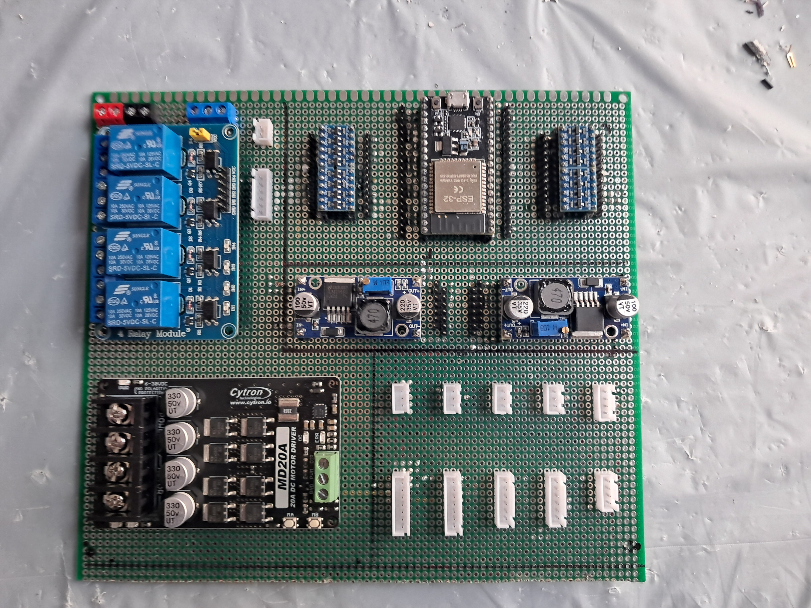
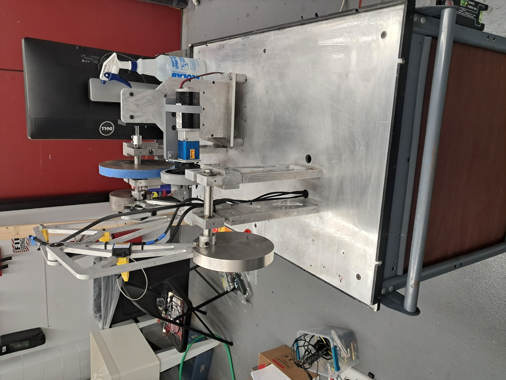

# Four-Bar Linkage Mechanism

## Overview

- This project restores and modernizes a four-bar linkage machine originally built by WPI students in 1993. The machine had been on continuous display in the Mechanical Engineering department, running nearly 24/7, until age and outdated technology caused it to degrade.
- The restored version introduces a new control board powered by an ESP32 and integrates modern sensors, safety systems, and motor control electronics. It is now used both as an educational tool and as a testbed for sensor comparison experiments, helping students understand how mechanical and electronic systems interact.

**Key Features**

- ESP32-based Control Board
  - Central controller for logic, motion, and data acquisition.
- Cytron Motor Driver
  - Reliable motor control with smooth operation.
- Safety Systems
  - Emergency stop button.
  - Door-close sensor interlock.
  - Integrated emergency warning light.
- IMU Data Collection & Comparison
  - Multiple IMUs from different manufacturers placed at different points on the machine.
  - Includes two wireless IMUs.
  - Enables sensor-to-sensor performance comparison.
  - Provides insights into how mechanical vibrations, linkage motion, and electronics align.
- Educational Value
  - Teaches kinematics and mechanism design.
  - Demonstrates mechatronics integration (mechanical + electronics + control).
  - Highlights differences in sensor performance and data reliability.
  - Used in WPI’s mechanical engineering coursework.

## System Workflow

- Sensors (IMUs, safety switches) send data to the ESP32.
- ESP32 processes inputs and:
  - Controls the motor through the Cytron driver.
  - Activates emergency light & shutdown if unsafe conditions occur.
  - Logs IMU data for sensor performance comparison.
- Collected IMU data is analyzed to study:
  - How motion is captured at different linkage points.
  - Variations across sensor manufacturers.
  - Effects of wireless vs wired IMUs.

## Educational Outcomes

- Students gain hands-on experience with:
  - Four-bar linkage kinematics.
  - Embedded systems and motor control.
  - Data logging and sensor reliability.
  - Interdisciplinary nature of mechatronics.
- The system provides a real-world case study of how mechanical wear, electronic updates, and sensor integration must be balanced in engineering design.

## Acknowledgments

- WPI Class of 1993 team for building the original showcase machine.
- WPI Mechanical Engineering Department for preserving and reusing this machine as an educational tool.

## Images

- Four-Bar Linkage Mechanism New Control Board

- Four-Bar Linkage Mechanism

https://github.com/user-attachments/assets/47433aa5-5748-4bc3-aa39-bb331e4e33d4

