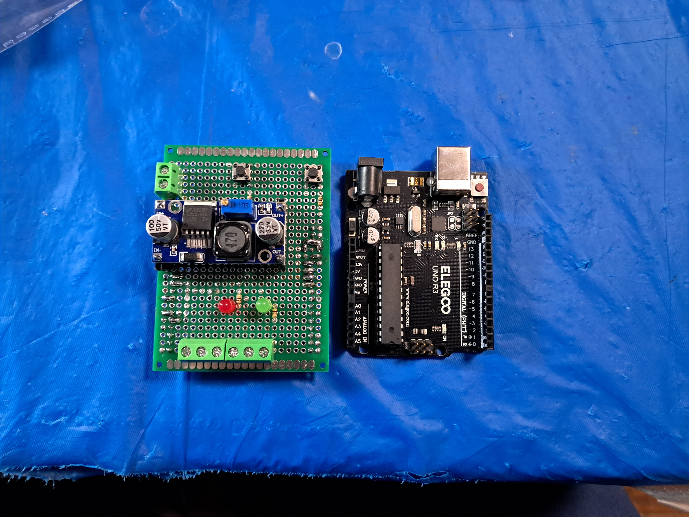
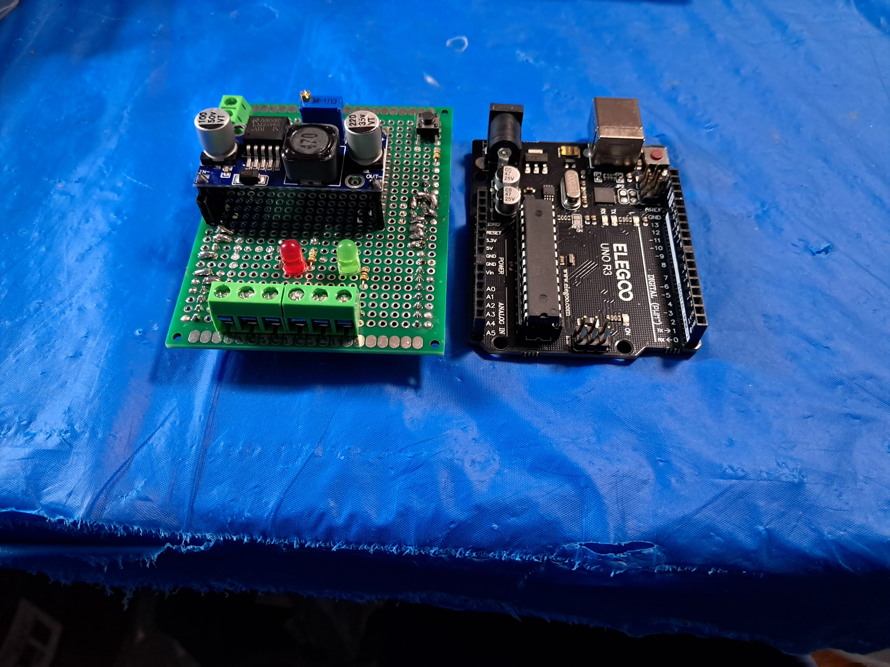

# Tensile Test Machine

A custom-built Tensile Test Machine designed for material testing with precise control over motion profiles, speed, and cycling behavior. This machine is ideal for low-speed, high-accuracy tensile testing of small to medium-sized specimens.

---

## Features

- **Trapezoidal Motion Profile**: Smooth acceleration and deceleration for reduced mechanical shock.
- **Variable Speed Control**: Adjustable from **0.1 mm/s to 3 mm/s**.
- **Adjustable Stroke Length**: Test distances configurable between **2 cm to 25 cm**.
- **Cycle Count Control**: Set the number of repetitions for fatigue or endurance testing.
- **High Torque Output**: Generates up to **80 kg·cm torque** using a stepper motor and driver system.

---

## Operating Modes

1. **Discrete Step Mode**  
   Moves in fixed-length increments with a pause between each step — ideal for stepwise loading tests or observation-based tests.

2. **Continuous One-Way Mode**  
   Smooth one-directional movement without reversal — useful for single-pass tensile or elongation tests.

3. **Cycling Mode**  
   Repeats forward and backward motion for a user-defined number of cycles — suitable for fatigue or hysteresis testing.

---

## System Architecture

- **Control Board**: Elegoo Arduino Mega 2560
- **Motor Driver**: Stepper driver with microstepping support
- **Power Supply**: 24V DC regulated power
- **User Interface**: Configurable parameters via serial interface or onboard UI

---

## Components Used

| Component            | Details                        |
|----------------------|---------------------------------|
| Microcontroller      | Elegoo Arduino Mega 2560       |
| Motor Driver         | TB6600  |
| Stepper Motor        | NEMA23 - 80 kg·cm torque  |
| Power Supply         | 24V DC                         |

---

## Usage

### 1. Parameter Setup

- **Speed**: 0.1 mm/s to 3 mm/s
- **Distance**: 2 cm to 25 cm
- **Cycle Count**: Any positive integer
- **Mode**: Choose from Discrete, Continuous, or Cycling

### 2. Running the Machine

- Upload the firmware to Arduino Mega via USB.
- Configure parameters through the serial monitor or UI.
- Power the system using a 24V DC supply.
- Start the test and the machine will execute the motion profile according to the selected mode.

---

## Example Use Cases

- Material tensile strength testing
- Durability and fatigue testing
- Micro-component stretching and loading
- Custom automation requiring low-speed, high-torque motion

## Images

- Tensile Stress Test Machine

https://github.com/user-attachments/assets/fbec812b-7db0-4aa1-a88f-8b0b5e9517f5
https://github.com/user-attachments/assets/87650bf9-1efb-4e67-8b14-c8b6a8dca0fa

